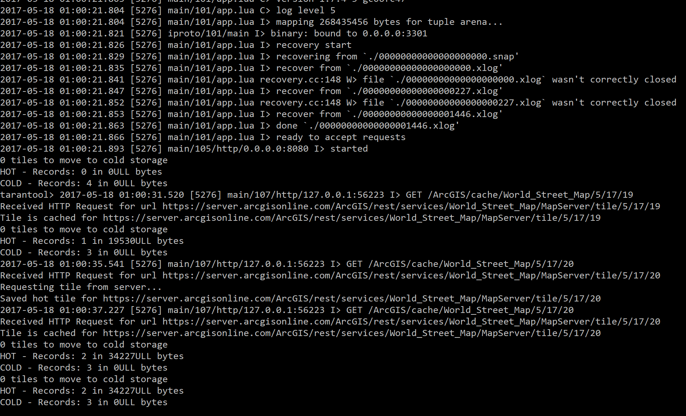

# esri-tile-cacher

This is a simple [tarantool](https://tarantool.org)-based application to cache map tiles from ESRI ArcGIS.
It is built with [Lua](http://www.lua.org).

It has two storage spaces, **hot** and **cold**, the first one is stored in RAM
and is very fast. The second is stored on disk and is slower. Tiles which have
been accessed recently are moved to the **hot storage**, as they grow stale they
are moved to the **cold stoage**. Currently the treshold is set to two minutes.

The collection of tiles from hot to cold storage is done using [fibers](https://tarantool.org/doc/1.7/reference/reference_lua/fiber.html) which
are cooperative lightweight threads. In a real scenario, another process (or even
  more than one can be used to collect tiles).

### This is not a real product, this is a proof-of-concept created in couple minutes.

# Requirements
* Tarantool 1.7+
* tarantool-fiber
* tarantool-http

# Running it
To run the little server use:

```$ tarantool app.lua```

Call it with _curl_ like:

```$ curl -v "http://localhost:8080/ArcGIS/cache/World_Street_Map/5/17/19"```

If that tile is not cached, then it will request from ArcGIS and cache.


